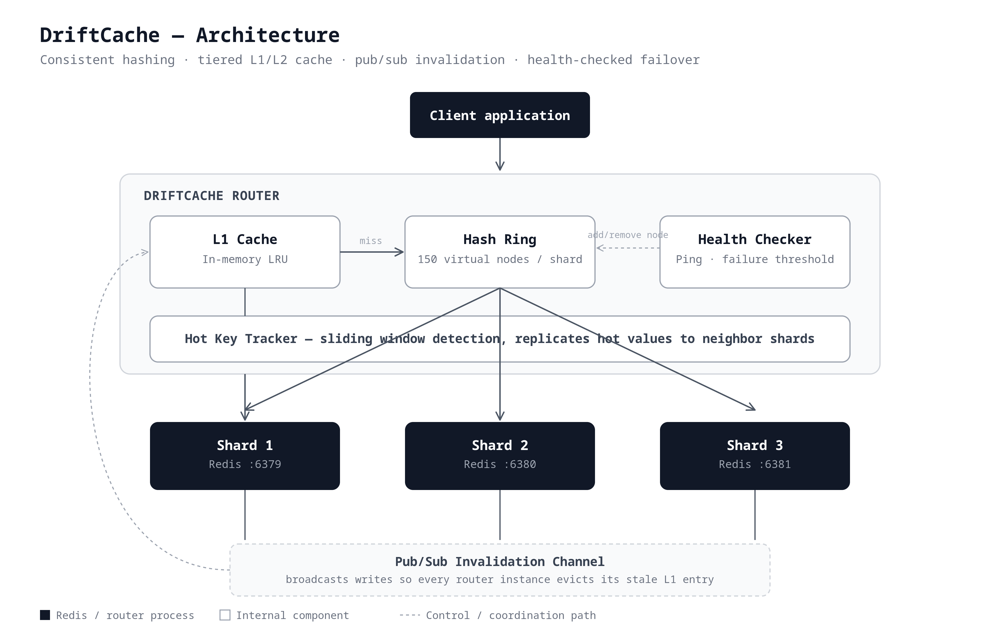
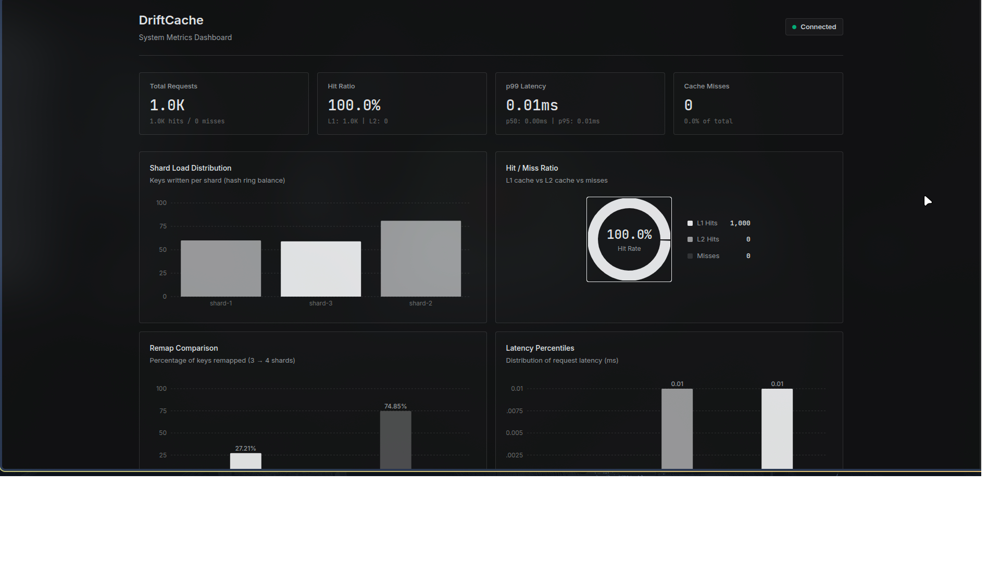
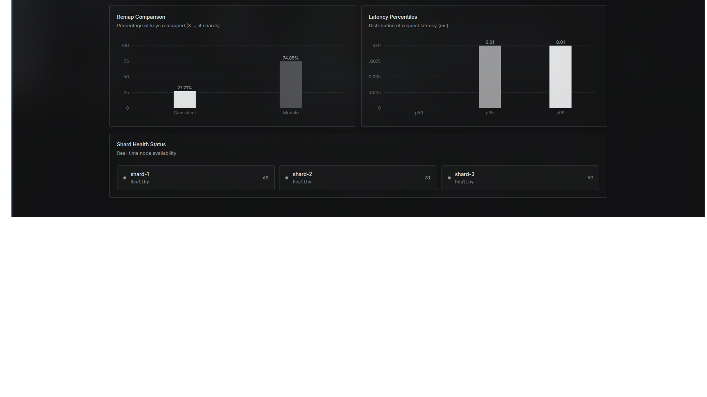

# DriftCache

<p align="center">
  <strong>A distributed cache router with consistent hashing, tiered L1/L2 caching, pub/sub invalidation, health-checked failover, and hot-key replication.</strong>
</p>

<p align="center">
  <a href="#quickstart">Quickstart</a> ·
  <a href="#architecture">Architecture</a> ·
  <a href="#api-reference">API</a> ·
  <a href="#benchmarks">Benchmarks</a> ·
  <a href="#design-decisions">Design</a>
</p>

---

## Problem

Scaling a single Redis instance eventually hits limits: memory ceiling, single-threaded bottleneck, single point of failure. Adding more Redis instances creates a routing problem — which shard holds which key? Naive modulo hashing (`hash(key) % N`) breaks catastrophically when you add or remove a shard, remapping **~75%** of keys and causing a thundering herd of cache misses.

DriftCache solves this with:

| Feature | What it does |
|---------|-------------|
| **Consistent hash ring** | Routes keys to shards. Adding/removing a shard only remaps ~1/N of keys (~25%), not ~75%. |
| **L1 in-memory cache** | Sub-millisecond reads for hot data. LRU eviction keeps memory bounded. |
| **L2 Redis layer** | L1 miss → fetch from Redis before going to origin. |
| **Pub/sub invalidation** | When one process writes a key, all other processes evict it from their L1, preventing stale reads. |
| **Health-checked failover** | Continuous ping-based health checks. Down shards are removed from the ring; recovered shards rejoin. |
| **Hot-key replication** | Detects Zipfian access patterns and copies hot values to neighbor shards, spreading read load. |

## Quickstart

### Prerequisites

- Node.js ≥ 18
- Docker + Docker Compose (for Redis instances)

### 1. Start Redis

```bash
git clone https://github.com/patil-piyush/driftcache.git
cd driftcache
docker-compose up -d   # Starts 3 Redis instances on ports 6379, 6380, 6381
```

### 2. Install & Build

```bash
npm install
npm run build --workspace=packages/core
```

### 3. Use as a library

```typescript
import { DriftCache, destroyShardClients } from "driftcache";

const cache = new DriftCache({
  shards: [
    { id: "shard-1", host: "localhost", port: 6379 },
    { id: "shard-2", host: "localhost", port: 6380 },
    { id: "shard-3", host: "localhost", port: 6381 },
  ],
  l1MaxSize: 1000,         // Max 1000 entries in L1 (LRU)
  defaultTtlSeconds: 300,  // Keys expire after 5 minutes
});

await cache.initialize();

// Write
await cache.set("user:42", { name: "Alice", plan: "pro" });

// Read — L1 hit (sub-ms), L2 hit (Redis), or miss (null)
const user = await cache.get("user:42");

// Delete
await cache.delete("user:42");

// Metrics
const snapshot = cache.getMetricsSnapshot();
console.log(snapshot.hitRatio);  // 0.95
console.log(snapshot.latency);   // { p50: 0.02, p95: 0.05, p99: 0.19 }

// Shutdown
await cache.destroy();
await destroyShardClients();
```

### 4. Use as a proxy server

```bash
# Start the HTTP proxy (REST API in front of DriftCache)
cd packages/proxy
npx ts-node src/cli.ts start --port 7000

# Or with custom shards:
npx ts-node src/cli.ts start --port 7000 --shards shard1:redis1.example.com:6379,shard2:redis2.example.com:6379
```

```bash
# PUT a key
curl -X PUT http://localhost:7000/cache/session:abc \
  -H "Content-Type: application/json" \
  -d '{"value": {"userId": 42}, "ttlSeconds": 600}'

# GET a key
curl http://localhost:7000/cache/session:abc

# DELETE a key
curl -X DELETE http://localhost:7000/cache/session:abc

# Metrics & health
curl http://localhost:7000/metrics
curl http://localhost:7000/health
```

### 5. Dashboard

```bash
cd packages/dashboard
npm run dev    # Opens at http://localhost:5173
```

The dashboard polls `/metrics` and `/health` from the proxy and displays:
- Shard load distribution (bar chart)
- L1/L2 hit-miss ratio (donut chart)
- Latency percentiles (p50/p95/p99)
- Consistent vs modulo hashing remap comparison
- Real-time shard health status

## Architecture


## Dashboard




### Read Path

1. Check **L1 cache** (in-memory LRU) → sub-millisecond if hit
2. On L1 miss, check **L2** (Redis, routed via hash ring) → low-ms if hit
3. On L2 miss, return `null` (caller fetches from origin)

### Write Path

1. Write to **L1** (local)
2. Write to **L2** (Redis shard via hash ring)
3. **Publish invalidation** (pub/sub) → other processes evict from their L1
4. If key is "hot," **replicate to neighbor shards** on the ring

### Failover Path

1. **Health checker** pings each shard every `healthCheckIntervalMs` (default 2s)
2. After `healthCheckThreshold` consecutive failures (default 3), shard is marked **down**
3. Downed shard is **removed from the hash ring** → keys re-route to neighbors
4. When the shard recovers, it's **re-added** to the ring

## API Reference

### `DriftCache`

```typescript
new DriftCache(config: DriftCacheConfig)
```

| Config Option | Type | Default | Description |
|---|---|---|---|
| `shards` | `ShardConfig[]` | required | Redis shard connection details |
| `l1MaxSize` | `number` | required | Max L1 cache entries (LRU eviction) |
| `defaultTtlSeconds` | `number` | required | Default key expiry in seconds |
| `virtualNodeCount` | `number` | `150` | Virtual nodes per shard on the ring |
| `healthCheckIntervalMs` | `number` | `2000` | Health check ping interval |
| `healthCheckThreshold` | `number` | `3` | Failures before marking shard down |
| `hotKeyThreshold` | `number` | `100` | Accesses/window to trigger replication |
| `hotKeyWindowMs` | `number` | `5000` | Sliding window for hot-key detection |
| `hotKeyReplicaCount` | `number` | `2` | Extra shards to replicate hot keys to |

#### Methods

| Method | Returns | Description |
|---|---|---|
| `initialize()` | `Promise<void>` | Start pub/sub, health checks, hot-key tracker |
| `get(key)` | `Promise<unknown \| null>` | L1 → L2 → null |
| `set(key, value, opts?)` | `Promise<void>` | Write to L1 + L2, publish invalidation |
| `delete(key)` | `Promise<void>` | Remove from L1 + L2, publish invalidation |
| `getMetricsSnapshot()` | `MetricsSnapshot` | Current metrics (hits, latency, distribution) |
| `getHealthChecker()` | `HealthChecker` | Access to shard health status |
| `getHotKeyTracker()` | `HotKeyTracker` | Access to hot-key detection data |
| `getHashRing()` | `HashRing` | Access to the consistent hash ring |
| `destroy()` | `Promise<void>` | Stop timers, disconnect pub/sub |

### `destroyShardClients()`

```typescript
import { destroyShardClients } from "driftcache";
await destroyShardClients(); // Call once at process exit
```

Shard clients live in a shared global pool. Call this after all DriftCache instances are destroyed.

## Benchmarks

Real numbers from live Redis testing (3 shards, localhost, 100,000 sample keys unless noted):

| Metric | Value |
|---|---|
| L1 hit latency | **0.02ms** (p50) |
| L2 hit latency | **0.19ms** (p99) |
| Key distribution (3 shards, 150 vnodes) | **~31% / 34% / 35%** (max ~7% deviation) |
| Remap on shard add (consistent hashing) | **~27.21%** of keys (theoretical optimum: 25%) |
| Remap on shard add (naive modulo) | **~74.85%** of keys |
| Failover detection time | **~1311ms** (2s interval, 3-failure threshold) |
| Failover recovery time | **~786ms** |
| During-outage success rate | **100%** (200/200 requests re-routed to live shards) |
| Hot-key replication peak load | **~40%** of traffic absorbed by the hottest key without single-shard bottleneck |

> **Note:** these figures come from the most recent verified benchmark runs in this project's build process. Re-run `scripts/remap-benchmark.js`, `scripts/failover-test.js`, and `scripts/hotkey-test.js` yourself before quoting these numbers publicly (e.g. in an interview) to confirm they still reproduce on your machine.

## Design Decisions

### Why MurmurHash3 finalization mix?

The base hash is FNV-1a, which is fast but has poor avalanche behavior on its own — small input changes don't spread well across output bits, which hurts even distribution across the ring. Applying MurmurHash3's `fmix32` finalization step after FNV-1a fixes this: it reduced max shard distribution deviation from **~65%** (raw FNV-1a) to **~7%** (at 150 virtual nodes), with no change to the ring logic itself — only the hash function's output quality changed.

### Why filter self-published invalidations?

Without filtering, `set("key", value)` would publish an invalidation message that comes back to the *same* instance and evicts the just-written L1 entry. Each `Invalidation` instance generates a random `instanceId` and attaches it to messages; the subscriber filters out messages from its own ID.

### Why a global shard client pool?

Redis connections are expensive. Multiple DriftCache instances in the same process (e.g., separate caches for different data domains) should share the underlying TCP connections to each shard. The pool is module-level; cleanup is explicit via `destroyShardClients()`.

### Why 150 virtual nodes per shard?

Testing showed 150 vnodes achieves a good balance between distribution evenness (~7% max deviation) and ring lookup speed. Fewer vnodes (50) gave noticeably worse distribution; more (300+) gave diminishing returns for added memory and lookup cost.

## Project Structure

```
driftcache/
├── docker-compose.yml           # 3 Redis instances
├── packages/
│   ├── core/                    # The cache library
│   │   ├── src/
│   │   │   ├── DriftCache.ts    # Main orchestrator
│   │   │   ├── hashRing.ts      # Consistent hash ring
│   │   │   ├── shardClient.ts   # Redis connection pool
│   │   │   ├── l1Cache.ts       # LRU in-memory cache
│   │   │   ├── invalidation.ts  # Pub/sub cache coherence
│   │   │   ├── healthChecker.ts # Ping-based failover
│   │   │   ├── hotKeyTracker.ts # Hot-key detection + replication
│   │   │   ├── metrics.ts       # Latency & distribution tracking
│   │   │   └── index.ts         # Barrel exports
│   │   └── test/
│   │       ├── *.test.ts        # Unit tests (47 tests, mocked Redis)
│   │       └── liveRedis.test.ts # Integration tests (13 tests, real Redis)
│   ├── proxy/                   # HTTP REST proxy
│   │   └── src/
│   │       ├── server.ts        # Express routes
│   │       └── cli.ts           # CLI entrypoint
│   └── dashboard/               # React + recharts monitoring UI
│       └── src/
│           ├── App.tsx
│           ├── hooks/useMetrics.ts
│           └── components/      # ShardLoadChart, HitMissRatio, etc.
└── scripts/
    ├── failover-test.js         # Automated failover verification
    └── hotkey-test.js           # Zipfian load test
```

## Local Development

```bash
# Start Redis shards
docker-compose up -d

# Run unit tests (no Redis needed)
npm run test:core

# Run live integration tests (requires Docker)
cd packages/core && npx jest test/liveRedis.test.ts --testTimeout=30000

# Start proxy + dashboard
cd packages/proxy && npx ts-node src/cli.ts start --port 7000
cd packages/dashboard && npm run dev

# Run failover test
node scripts/failover-test.js

# Run hot-key test
node scripts/hotkey-test.js
```

## License

MIT